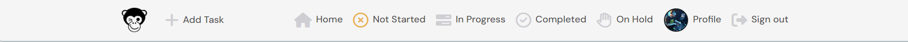
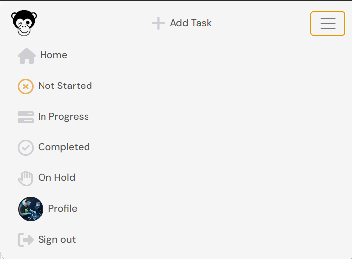
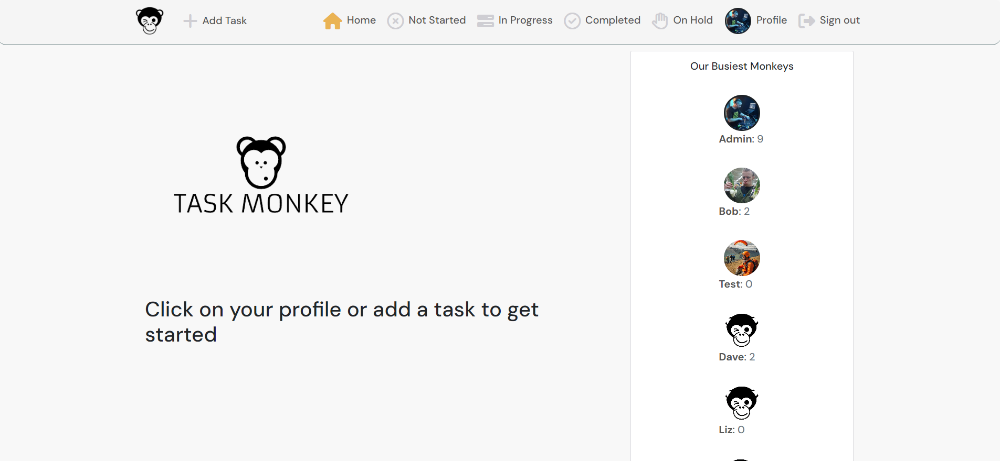

# Task Monkey - Productivity App

Developer: Mark Daniel

[View live website](https://taskmonkey-fcc370ffbd74.herokuapp.com/)

## Table of Contents

0. [About](#about)

1. [Project Goals](#project-goals)

   1. [User Goals](#user-goals)

2. [User Experience](#user-experience)

   1. [Target Audience](#target-audience)
   2. [User Requirements and Expectations](#user-requirements-and-expectations)
   3. [User Stories](#user-stories)
   4. [Site Owner Stories](#site-owner-stories)

3. [Wireframes](#wireframes)

4. [Technologies Used](#technologies-used)

   1. [Languages](#languages)
   2. [Libraries, frameworks and dependencies](#libraries-frameworks-and-dependencies)
   3. [Tools & Programs](#tools--programs)

5. [Agile Design](#agile-design)

6. [Design](#design)

   1. [Colors](#colours)
   2. [Fonts](#fonts)

7. [Project Structure](#project-structure)

   1. [Front End](#front-end)
   2. [Back End API](#back-end-api)

8. [Features](#features)

   1. [Implemented Features](#implemented-features)
   2. [Features to be Implemented](#features-to-be-implemented)

9. [Validation](#validation)

   1. [CSS](#css)
   2. [Html](#html)
   3. [Lighthouse](#lighthouse)
   4. [ESLint](#eslint-validation)

10. [Testing](#testing)

11. [Deployment](#deployment)

    1. [Deploying in Heroku](#deploying-the-website-in-heroko)
    2. [Forking of Github repo](#forking-the-github-repository)
    3. [Cloning the Github repo](#cloning-the-repository-in-github)

12. [Credits](#credits)

    1. [Image](#images)
    2. [Code](#code)

13. [Thank You](#thank-you)

# About

 - Task Monkey is a productivity/task manager app to help users keep a visual list of important tasks, appointments and anything else that needs to be remembered.

### Developer Statement
 During production, I was under immense stressed caused by a house move. A company was contracted to take care of the packing, moving, cleaning the old house & unpacking in the new house. This turned out to be a bad choice as I had to take over a week to fix all of the mess that they caused which set me back several days. Code Institute's student care allowed me an extension to make up the lost time but unfortuntely, I was not able to get this production made to my own satisfactory level in it's current state.

 Future iterations will fix the broken avatar links, reinstate the search bar and properly filter the tasks to be shown on the correct pages

---

## Project Goals

 - The goal for this project was to build a platform for users to keep track of important items, which can then be filtered by date, completed status or priority.

Key functionality Goals
 - Simple and intuitive navigation
 - User authentication
 - User profiles (to allow future implementation of project - See [Future Enhancements](#future-enhancements)
 - CRUD functionality for tasks, comments and profiles
 - Filtering of tasks by status, priority, date and privacy

### User Goals

 - Ability to create a task
 - Add comments to created tasks
 - Amend and update content where required
 - Ability to filter tasks to get overview of ongoing or completed tasks
 
## User Experience

### Target Audience

 - Users that find a visual representation of important things to remember beneficial

### User Requirements and Expectations

 - Application with a clear purpose
 - An user-friendly interface that allows quick and efficient navigation
 - Responsive and visually simple design

### User stories

#### Navigation & Authentication

 - Navigation: As a user I can view a navbar from every page so that I can navigate easily between pages
 - Routing: As a user I can navigate through pages quickly so that I can view content seamlessly without page refresh
 - Authentication - Sign up: As a user I can create a new account so that I can access all the features for signed up users
 - Authentication - Sign in: As a user I can sign in to the app so that I can access functionality for logged in users
 - Authentication - Logged in Status: As a user I can tell if I am logged in or not so that I can log in if I need to
 - Authentication - Refreshing access tokens: As a user I can maintain my logged-in status until I choose to log out so that my user experience is not compromised
 - Navigation: Conditional rendering - As a logged out user I can see sign in and sign up options so that I can sign in/sign up
 - Avatar: As a user I can view user's avatars so that I can easily identify users of the application

#### Adding & Liking Tasks
 - Create tasks: As a logged in user I can create tasks so that I can keep them organised
 - View a task: As a user I can view the details of a single task so that I can learn more about it
 - Comment on a task: As a logged in user I can comment a task so that I can add any relevant information to it

#### The Tasks Page
 - View all tasks: As a user I can see a list of all my important tasks
 - As a user, I can search for tasks with keywords, so that I can find the tasks, profiles or comments that I need to see.
 - Infinite scroll: As a user I can keep scrolling through the images on the site, that are loaded for me automatically so that I don't have to click on "next page" etc

#### The Task Page
 - Task page: As a user I can view the tasks page so that I can read the comments thathave been added to the task
 - Edit task: As a task owner I can edit my tasks so that I can make corrections or update my task after they have been created
 - Create a comment: As a logged in user I can add comments to a post so that I can add additional information to each task
 - Comment date: As a user I can see how long ago a comment was made so that I know how old a comment is
 - View comments: As a user I can read comments on tasks so that I can read what additional information has been added (or a team discussion in a future release)
 - Delete comments: As an owner of a comment I can delete my comment so that I can control removal of my comment from the application
 - Edit a comment: As an owner of a comment I can edit my comment so that I can fix or update my existing comment

#### The Profile Page
 - Profile page: As a user I can view other users profiles so that I can see basic information about them (Future releases will expand on viewable information and interaction between users)
 - Most active profiles: As a user I can see a list of the most active profiles 
 - User profile - user stats: As a user I can view statistics about a specific user: bio, number of tasks so that I can learn more about them
 - Edit profile: As a logged in user I can edit my profile so that I can change my profile picture and bio
 - Update username and password: As a logged in user I can update my username and password so that I can change my display name and keep my profile secure

### Site Owner Stories

 - As a site owner I can provide full access to logged in user so that they can interact with the pages more independently
 - As a site owner I can restrict the interaction with website so that an unauthorised user cannot make changes in the app
 - As a site owner I can make sure my site is responsive so that user can view the website in all devices without any problem
 - As a site owner I want users to come to a custom error page so that they know that the requested page is not available to them

## Wireframes

## Technologies Used

### Languages

- HTML
- CSS
- Javascript
  - React

### Libraries, frameworks and dependencies

- [Axios](https://axios-http.com/docs/intro) - axios were used for promise-based HTTP. Justification: I used axios to send API requests from the React project to the API and avoid any CORS errors when sending cookies.
- [ClassNames](https://www.npmjs.com/package/classnames/) - JavaScript utility for conditionally joining classNames together, used in the FeedbackMsg component. This is used to apply the styles dynamically based on the type of style and apply more than one style to elements in FeedbackMsg component
- [JWT](https://jwt.io/) - library to decode out JSON Web token. Justification: I used JWT to prevent unauthenticated user from making extra network requests to refresh their access token. Also used to remove the timestamp from the browser when the user refreshes token expires or the user logs out.
- [React 17](https://17.reactjs.org/) - JavaScript library for building user interfaces
- [React-Bootstrap 4.6](https://react-bootstrap-v4.netlify.app/) - Justification: I used Bootstrap React library for UI components, styling and responsiveness.
- [React Infinite Scroll](https://www.npmjs.com/package/react-infinite-scroll-component) - Justification: I used this component to load content (posts/comments) automatically as the user scrolls towards the bottom of the page without having to jump to next/previous page.
- [React Router](https://v5.reactrouter.com/web/guides/quick-start) - used for dynamic routing. Justification: I used this library to enable the navigation among views of various components and control what the user sees depending on the URL they have accessed in the browser.
- [Prettier](https://prettier.io/): This extension was used to format code for all files
- [ES7 Snippets](https://open-vsx.org/extension/dsznajder/es7-react-js-snippets): this was used for keyboard shortcuts when creating jsx functions

### Tools & Programs

- [Am I Responsive](http://ami.responsivedesign.is/) was used to create the multi-device mock-up at the top of this README.md file
- [Chrome dev tools](https://developers.google.com/web/tools/chrome-devtools/) was used for debugging of the code and checking site for responsiveness
- [Cloudinary](https://cloudinary.com/) to store static files
- [Favicon.io](https://favicon.io) for making the site favicon
- [Font Awesome](https://fontawesome.com/) - Icons from Font Awesome were used throughout the site
- [Google Fonts](https://fonts.google.com/) - import of font for the website
- [CodeAnyWhere](https://app.codeanywhere.com/) was IDE used for writing code and to push the code to GitHub
- [GitHub](https://github.com/) was used as a remote repository to store project code
- Validation:
  - [WC3 Validator](https://validator.w3.org/) was used to validate the html
  - [Jigsaw W3 Validator](https://jigsaw.w3.org/css-validator/) was used to validate the css
  - [ESLint](https://eslint.org/) used to validate JSX code
  - [Lighthouse](https://developers.google.com/web/tools/lighthouse/) used to validate performance, accessibility, best practice and SEO of the app

## Agile design

### About

- Agile development is the most effective way to development of any website
- This was able to do basic development of website using user story template

### User Story Template

- Using Github issues first I created the template for a user story that was later used to create user stories.

### Kanban Board

- As a visual representation of the project's status, showing what tasks are to be done, in progress and completed.Each task is represented as a card on the board, and the cards can be moved from one column to another to show progress.

## Design

### Fonts

The font chosen was [DM Sans](https://fonts.google.com/specimen/DM+Sans) from googlefonts

## Project Structure

### Front-End

#### React

React is a declarative, efficient, and flexible JavaScript library for building user interfaces. Its primary goal is to make it easy to reason about an interface and its state at any point in time, by dividing the UI into a collection of independent and reusable components ([source](https://www.freecodecamp.org/news/the-react-handbook-b71c27b0a795/)).

I used React for this application for several reasons:

- Speed - applying React significantly increases the page loading speed and reducing the wait, which affects user experience and satisfaction
- Flexibility - the React code is easier to maintain and is flexible due to its modular structure, compared to other front-end frameworks
- React Bootstrap - excellent choice for improving user experience, used for styling and responsiveness. It comes with ready-to-use React built components. They are implemented with accessibility in mind, which is a vital factor when creating a front-end application.
- Reusability of components - no need to write various codes for the same features

There were various components created and reused across this application.

- `<Asset />` - multi purpose component, used to display a range of items due to being passed props.

  - Those include a loading spinner from React Bootstrap, image with source and alt attribute or a message consisting of a paragraph.

- `<Avatar />` - resuable component, used to display the relevant user profile picture.

  - This component uses props which can specify the source of the image and also its size
  - This components was used in profile avatar, event owner, comment create form and comments posted

- `<DropDowns />` - resuable component, used to display the three dots option button based on the required rights of the user.

  - This was used for user who are authorised to make changes. For example, for user to edit and delete their own comments and user to edit their profile, change their username and password.

- `<LogoComponent />` - resuable component, used to display the site logo on several pages

  - This component was used on signin/up pages and the homepage
 
- `<NavBar />` - resuable component, used for easy navigation of the site.

  - This component is reusable as it will display different icons based on a users logged in status.
  - If no user is logged in a log in, sign up and contact icon will be available however if a user is currently logged in, the full range of icons will be available apart from log in.

- `<NotFound />` - specific component, used to display a custom 404 page made up of an image file for when the page does not exist.

There were various pages created and used in this application

- auth - The auth page group consisted of the following files:

  - SignInForm.js - This file handles the Login form
  - SignUpForm.js - This file handles the Sign up form

- comments - The comments page group consisted of the following files:

  - Comment.js - This file returns the comments
  - CommentEditForm.js - This file handles the comment edit form
  - CommentCreateForm.js - This file handles the create comment form

- profiles - The profiles page group consisted of the following files:

  - Profile.js - This file returns the profile section
  - ProfilePage.js - This file returns the entire Profile page
  - ActiveProfiles.js - This file returns the users of the site as per the number of tasks created
  - ProfileEditForm.js - This file handles the profile edit form
  - UsernameForm.js - This file handles the username change form
  - UserPasswordForm.js - This file handles the password change form

### Back-End API

#### Django REST Framework

The API for this Front-End application was built with the Django REST Framework. The repository with a README file for the DRF Back-End can be found [here](***).

##### Back to [top](#table-of-contents)

## Features

### Implemented Features

#### Navigation(Navbar)
NavBar Logged in

NavBar Logged out

NavBar Mobile

NavBar Mobile Expanded

- Navbar consists of Logo image and is displayed in all pages for easy navigation of website
- Navbar consists of name of website which is displayed in larger device
- Logo and wePbsite name both are links for home page
- Navbar consists of a links to a signin page and signup page for logged out users
- Authenticated/Signed in user can see additional icons as follows:
  - Add tasks: It opens the task create form page
  - In Progress: Shows tasks which users have as on-going
  - Completed tasks: Shows tasks which users have marked as completed
  - Logout: This is used for user to logout
  - Profile: This shows the user avatar and opens the user's profile page
- Feature is fully responsive and on smaller screen sizes it coverts into a 'Hamburger menu'

#### Sign Up Page

- This page consists of sign up form for user to create new account
- New users can access this page by clicked on SignUp link on Navbar

#### Sign In Page

- This page consists of sign in form for existing user to signin using their credentials
- Users can access this page by clicking on SignIn link on Navbar

#### HomePage

- Displays the logo and instructions on how to view tasks

##### Active Profiles (Our Top Users)

- This shows a list of the users that have added the highest amount of tasks when logged in, and the site logo when logged out

#### Profile Page

- This page consists the detail of user including their bio, number of added tasks
- User can access other's profile by clicking on avatar of other users
- Logged in user can access this page by clicking on their avatar image in Navbar

#### Profile Edit Page

- This page consists of profile form where loggedin user can update their profile data
- Profile owner can access this page by clicking on edit profile in their profile page
- After successful update user is displayed successful message

#### Change Username Page

- This page consists of username change form where loggedin user can update their username
- Profile owner can access this page by clicking on change username in their profile page
- After successful update user is displayed successful message

#### Change Password Page

- This page consists of username change form where loggedin user can update their password
- Profile owner can access this page by clicking on change password in their profile page
- After successful update user is displayed successful message

### Unresolved Bugs 

 - Logo image overlap on homepage on mobile devices

### Fixed Bugs
- Edit profile - I encountered and issue when trying to edit the profile bio where the console showed an error regarding an unmounted component. 
  

  This was fixed by researching extensively and realising that I had set the serializer field type incorrectly in the backend. Once the fields had been changed from ReadOnlyField to a suitable replacement, depending on the field type required, all worked as intended

 - Avatar images not displaying - the avatar images are not displaying in the 'Active Profiles' section.
 
 This was fixed by updating the information that was being called from the API in the AxiosReq

 - Filters - I have been unable to get the pages to display the correct filtered information. I wanted a separate list of tasks to be displayed based on the status (not started, in progress, completed, on hold), but with my knowledge limited to what had been shown in the moments walkthrough, i was unable to translate that into a functioning solution in my app.

 This was fixed by adding in several more links on the NavBar, and adjusting the routing to allow the page to display the correct information. I have now added a separate navbar link to a page for each of the available Task status options

### Future Enhancements

- upload attachments to keep documents relevant to the task together with the task information
- Create Teams & Projects for collaborative tasks
- Edit list view to show a summary which expands to shows detailed view
- Add a tickbox to mark tasks as complete
- Reinstate Search Box

## Validation

### CSS

- [Jigsaw W3 Validator](https://jigsaw.w3.org/css-validator/)was used to validate the css in the project.
- Validator with no errors.
- The deployed app was passed as url input for validation

### Html

- [WC3 Validator](https://validator.w3.org/) was used to validate the html in the project
- The deployed app was passed as url input for validation
- No errors were found

### Lighthouse

- [Lighthouse](https://developers.google.com/web/tools/lighthouse/) for performance, accessibility, progressive web apps, SEO analysis of the project code here are the results:

Home

Home after amendments

Home Mobile

Home Mobile after amendments

Profile

Profile after amendments

Profile Mobile

Profile Mobile after amendments

### ESLint Validation

- The JSX code was validated using the ESLint utility.
- The library was preinstalled in Codeanywhere IDE
- The code was getting validated so the errors were corrected during development process
- The library was also installed later using [ESLint website](https://eslint.org/) for final validation
- Few errors were shown which has been documented in Bug and fixes in TESTING.md
- No errors remained before final submission

## Testing

Please see [Testing](/TESTING.md) for detailed description of all testing undertaken during this build
 
## Deployment

### Deploying the website in Heroko

- Before deploying in Heroku, a Procfile was created: Very important for deployment and must be added with capital P. This file instructions Heroku which server to use

#### Login or create an account at Heroku

- Make an account in Heroko and login

#### Creating an app

- Create new app in the top right of the screen and add an app name.
- Select region
- Then click "create app".

#### Open settings Tab

##### Click on config var

- No key or value was added as it is already connected to API

##### Add Buildpacks

- Add python buildpack first
- Add Nodejs buildpack after that

#### Open Deploy Tab

##### Choose deployment method

- Connect GITHUB
- Login if prompted

##### Connect to Github

- Choose repositories you want to connect
- Click "Connect"

##### Automatic and Manual deploy

- Choose a method to deploy
- After Deploy is clicked it will install various file

##### Deployment

- Project was deployed in Heroku

### Forking the GitHub Repository

1. Go to the GitHub repository
2. Click on Fork button in top right corner
3. You will then have a copy of the repository in your own GitHub account.
4. [GitHub Repository](https://github.com/Sinha5714/humanitas-events-pp5)

### Cloning the repository in GitHub

1. Visit the GitHub page of the website's repository
2. Click the “Clone” button on top of the page
3. Click on “HTTPS”
4. Click on the copy button next to the link to copy it
5. Open your IDE
6. Type `git clone <copied URL>` into the terminal

## Credits

### Images

Winking monkey image was taken from [Pinterest](https://co.pinterest.com/pin/461548661788480569/)  

The image used for notfound, was purchased from [Alamy](https://www.alamy.com/three-wise-monkeys-with-hands-covering-eyes-ears-and-mouth-see-no-evil-hear-no-evil-speak-no-evil-cute-cartoon-illustration-line-art-drawing-image552512145.html?imageid=14F9FB12-8809-4677-A928-505D565E9F96&p=846793&pn=1&searchId=b5ae58179a6f5d8fb9e38b24a9e4d0f5&searchtype=0) and cropped

### Code

- The code was heavily based on the [Moments](https://github.com/Code-Institute-Solutions/moments) walkthrough. I felt i was unable to create something completely unique as i feel that 20 weeks is not enough time to get enough knowledge of the languages and frameworks used in the later modules of the course. The technicalities required for me to create this app in a way that i feel satisfied will take considerable more time to allow me to research and learn more about react, jsx and Rest APIs

- For creating the available choices in the API for the front end forms to submit the correct data for the API to store [CHOICES](https://www.b-list.org/weblog/2007/nov/02/handle-choices-right-way/)

## Thank You

- The Code Institute Slack community for helping me when I was getting stuck with some challenges.
- Code Institute Tutor Support who were always able and will to help guide me when i was feeling lost
- My mentor Jubril Akolade, for providing valuable guidance and for explaining things in a way that helped me to understand