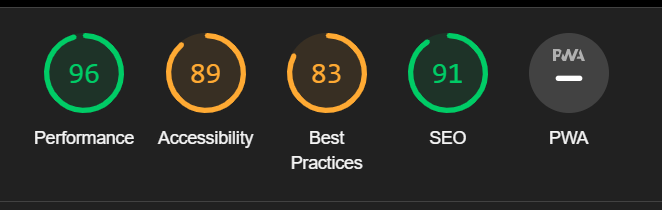
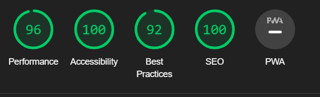
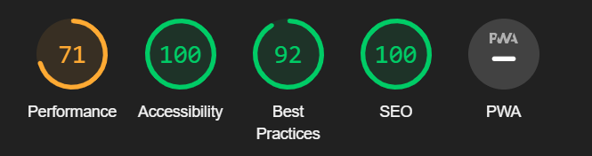
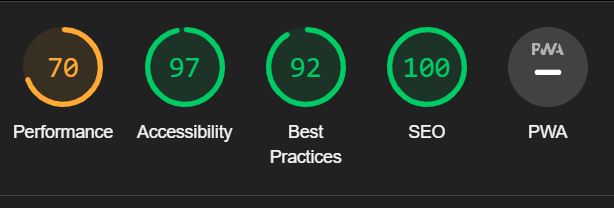
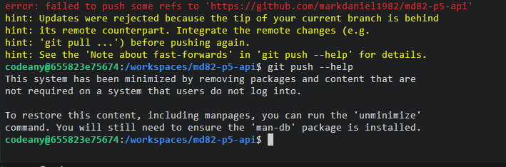
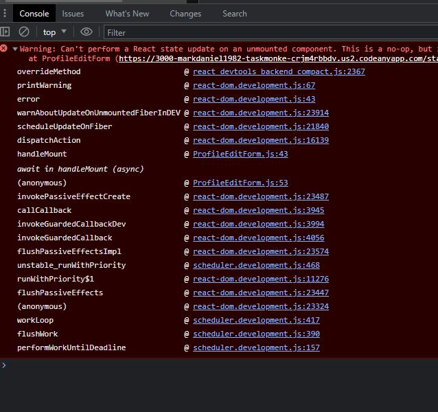

# TESTING

## Table of Contents

1. [Device Testing](#device-testing)
2. [Manual Testing](#manual-testing-of-user-stories)
3. [Bugs & Bug Fixes](#bugs--bug-fixes)
4. [Unfixed Bugs](#unresolved-bugs)

### Device testing

- Project was tested using various devices and browsers
- In all devices website was loading but unable to sign in in few devices especially smaller Apple devices
- See [bugs & bug fixes section](#bugs--bug-fixes)

  - Chrome

      

Screenshot

      
      

- Also tested various device sizes using [Dev.tools](https://developer.chrome.com/docs/devtools/)

### Manual testing

Basic site navigation
| TEST | OUTCOME | PASS/FAIL | RESOLUTION |
|:---:|:---:|:---:|:---:|
| User clicks on [website link](https://taskmonkey-fcc370ffbd74.herokuapp.com/)| Home page opens with Navbar for logged out users | Pass |
| Logged out user clicks on signin link on Navbar| Signin page opens| Pass |
| Logged in user clicks on feed page link on Navbar| Feed page opens| Pass |
| Logged out user clicks on signup link on Navbar | Signup page opens| Pass |
| User submit data in form successully| Signin page opens and user is registered | Pass |
| Logged out user clicks on signin link on Navbar | Signin page opens| Pass |
| User submit data in form succesully| Home page opens and user is signed in | Pass |
| Logged in user clicks on logout link on Navbar | Home Page opens and user is logged out | Pass |
| User scrolls through home page| Posted tasks are listed | Pass |
| User scrolls through home page| Posted events are listed | Pass |
| User clicks on task link| task detail page opens  | Pass |

Comments
| TEST | OUTCOME | PASS/FAIL | RESOLUTION |
|:---:|:---:|:---:|:---:|
| Logged in user scrolls down to comment section| Comment create form is visible with user avatar | Pass |
| Logged in user type comments and post| Comment is added and displayed in comment list  | Pass |
| Comment owner clicks on dropdown threedots next to their comments| Drop down menu with edit and delete button opens   | Pass |
| User clicks on edit icon| Comment edit form opens| Pass |
| User changes comment and click on save| Updated comment is displayed | Pass |
| Comment owner clicks on dropdown threedots next to their comments| Drop down menu with edit and delete button opens | Pass |
| User clicks on delete icon| Comment is deleted and no longer displayed| Pass |

Tasks
| TEST | OUTCOME | PASS/FAIL | RESOLUTION |
|:---:|:---:|:---:|:---:|
| Logged in user click on add task link on Navbar| Task create form page opens | Pass |
| User fill data and submit form successfully| Task created is displayed| Pass |
| User clicks on task link| Event detail page opens| Pass |
| Event owner clicks on dropdown threedots | Drop down menu with edit and delete button opens | Pass |
| User clicks on edit icon| Task edit form opens| Pass |
| User changes data of task and click on update| task is displayed with updated information | Pass |
| User clicks on delete icon| Success feedback message displayed and user taken to home page | Pass |

Profile
| TEST | OUTCOME | PASS/FAIL | RESOLUTION |
|:---:|:---:|:---:|:---:|
| User clicks on profile avatar| Profile page is opened| Pass |
| Logged in user clicks on profile avatar in Navbar| User's profile page opens| Pass |
| Profile owner clicks on dropdown threedots in profile page | Drop down menu with edit profile, change username and change password opens | Pass |
| User clicks on edit profile| Profile edit form opens| Pass |
| User updates the data and click on update| Page reloads with updated information| Fail | See unsolved bugs
| User clicks on change username| Change username form page opens| Pass |
| User updates the data and click on change| Profile page reloads with updated username displayed| Pass |
| User clicks on change password| Change password form page opens| Pass |
| User updates the data and click on change| Profile page reloads| Pass |
| User close the model|| Pass |

Most Active Users
| TEST | OUTCOME | PASS/FAIL | RESOLUTION |
|:---:|:---:|:---:|:---:|
| User opens homepage | Top task creators profiles are displayed on right of the page| Pass |

Infinite Scrolling
| TEST | OUTCOME | PASS/FAIL | RESOLUTION |
|:---:|:---:|:---:|:---:|
| User opens the website and keep scrolling down | Tasks are loaded without need to change page | Pass  |
| Logged in user scrolls down to comment section | Comments are loaded without need to change page| Pass |

Search
| TEST | OUTCOME | PASS/FAIL | RESOLUTION |
|:---:|:---:|:---:|:---:|
| Search bar displayed on homepage | No | Fail | See Unresolved bugs

Task Visibility
| TEST | OUTCOME | PASS/FAIL | RESOLUTION |
|:---:|:---:|:---:|:---:|
| Logged out user/not the task creator finds task detail page| Not found image is displayed| Pass  |
| Logged out opens other's profile page| profile bio is displayed but no task data| Pass  |

Responsive Layout
| TEST | OUTCOME | PASS/FAIL | RESOLUTION |
|:---:|:---:|:---:|:---:|
| Adjust layout based on device screen size| layout changes depending on screen width| Pass  |

## Bugs & Bug Fixes

### Devices Bug

| Bug | Details | RESOLUTION |
|:---:|:---:|:---:|
| Unable to login and signup with few devices and safari browser | Known bug | Ignored |

### Lighthouse

- [Lighthouse](https://developers.google.com/web/tools/lighthouse/) for performance, accessibility, progressive web apps, SEO analysis of the project code here are the results:

Home

Home after amendments

Home Mobile

Home Mobile after amendments

Profile

Profile after amendments

Profile Mobile

Profile Mobile after amendments

### W3C Html Validator

- No bug was found during Html validation

### Jigsaw CSS Validator

- No bug was found during CSS Validation

### JSX ESLint Validation

### REACT App

 - Git push error - Resolved by running "git pull" command
 

 - Priority validation error. API request was pointing to incorrect field. path modified  - Resolved.
 

 - Date Field validation error - Resolved by modifying API model field type from dateTimeField to dateField
 

 - NPM error. ignored 
 

 - Unsupported engine error - Resolved by modifying package.JSON to match requirements

## Unresolved Bugs
 - Edit profile - I encountered and issue when trying to edit the profile bio where the console showed an error regarding an unmounted component. I tried extensively to find a resolution, but even with help from tutor support, this was unable to be resolved before my submission deadline
  

 - Avatar images not displaying - the avatar images are not displaying in the 'Active Profiles' section. Again, I was unable to find time to get this resolved in this iteration

 - Filters - I have been unable to get the pages to display the correct filtered information. I wanted a separate list of tasks to be displayed based on the status (not started, in progress, completed, on hold), but with my knowledge limited to what had been shown in the moments walkthrough, i was unable to translate that into a functioning solution in my app
 
 - Logo image overlap on homepage on mobile devices